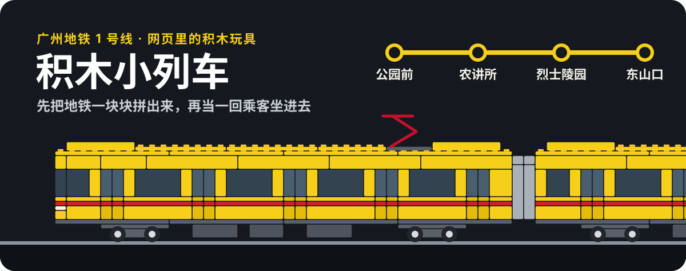
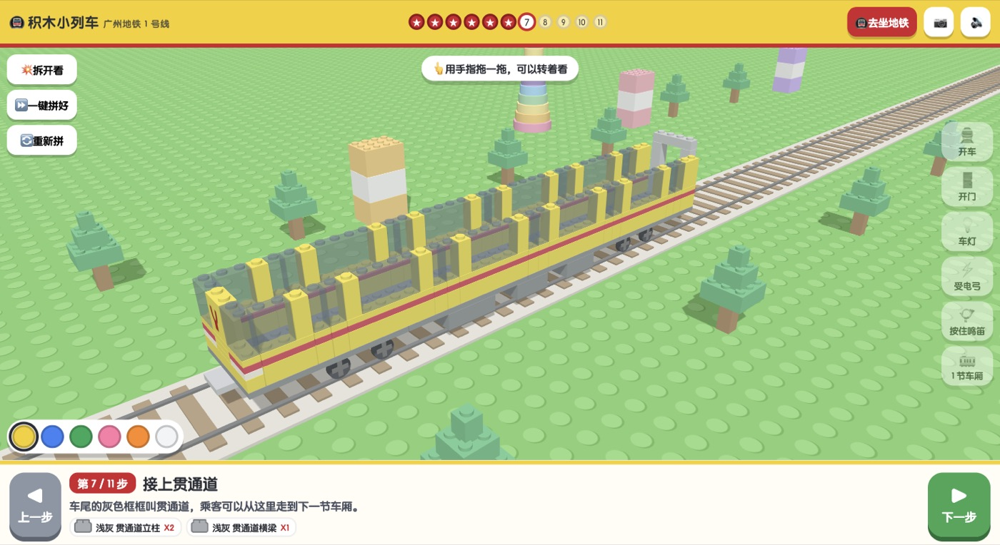
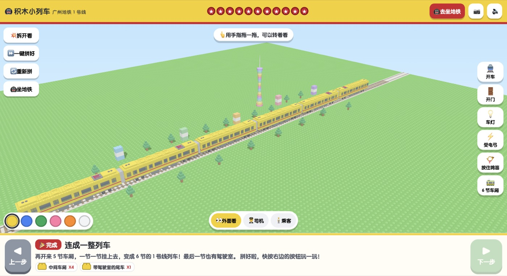
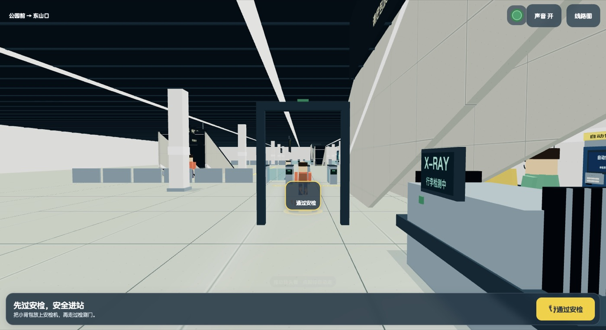
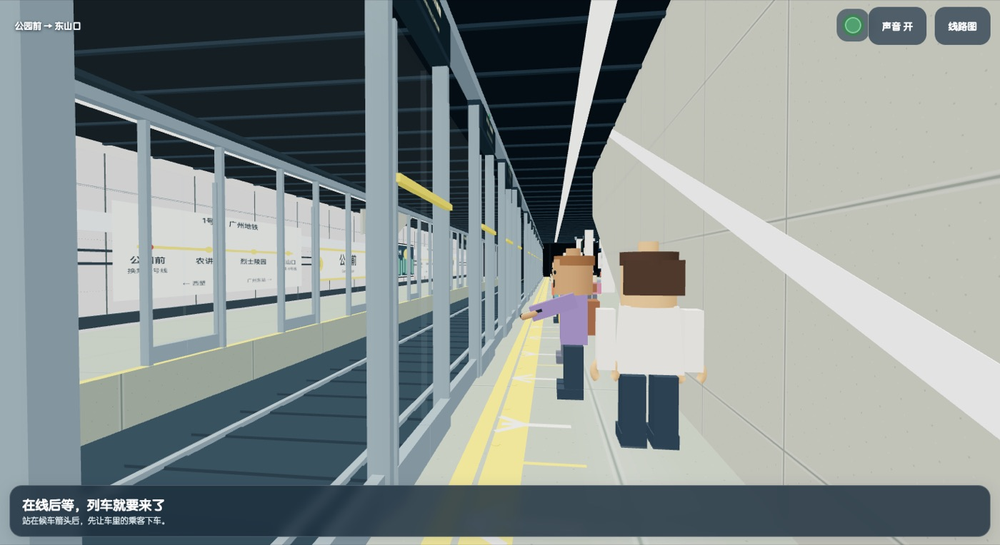
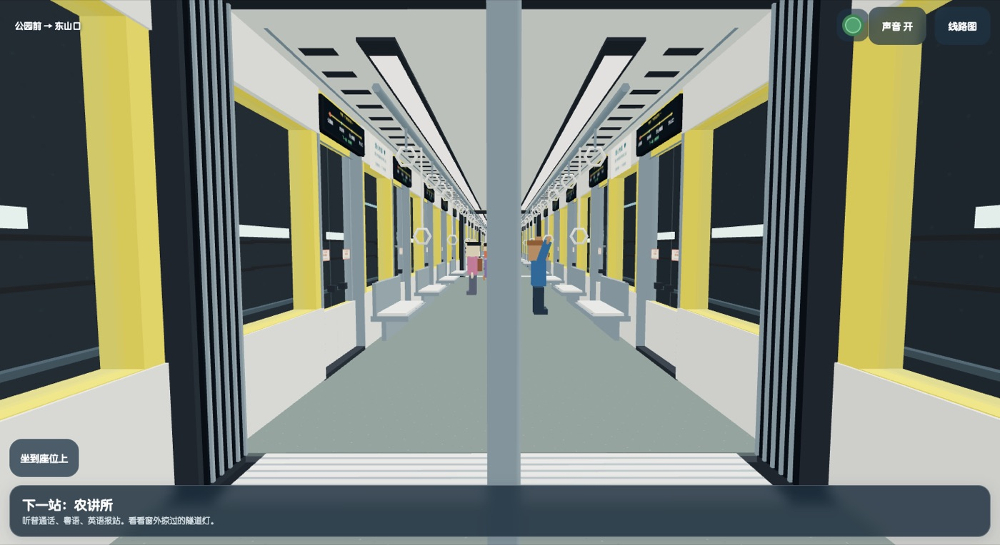
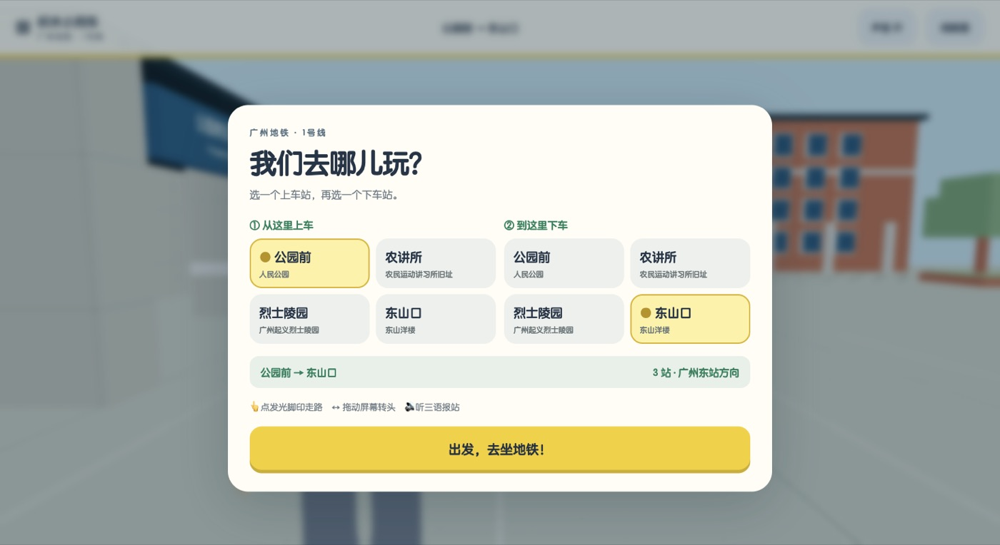

<p align="center">
  
</p>

一个给小朋友玩的网页玩具：照着一节广州地铁 1 号线的列车模型，在浏览器里用积木颗粒把它一块块拼出来；拼好之后，再以乘客的第一人称视角，从进站买票一直坐到出站。

打开就能玩，不用安装任何东西，在 iPad 上用手指操作。

<p align="center">
  
  
</p>
<p align="center">
  
  
</p>
<p align="center">
  
  
</p>

## 这个项目的由来

2026 年国庆假期我带小儿子去广州玩，逛了广州地铁博物馆，里面展出了 1 号线从无到有的整个建造过程。巧的是，我们住的酒店就在 1 号线的农讲所站旁边，那几天出门几乎全靠 1 号线，坐的一直是这列漂亮的黄色地铁。我们在博物馆里把它的模型买了回来，儿子特别喜欢。

他的这份喜欢给了我灵感：让 Claude 带着 Codex 干了几个小时，就做出了一个还不错的效果。儿子足足玩了两天。前几天刚坐过的地铁、刚买回来的车，转眼出现在他自己专属的 iPad 里，还能亲手拼、亲自坐，他觉得非常神奇。里面有很多点子是他自己提的，我都加了进去，整个过程很有意思，所以想把它分享出来。

页面算不上精良，但对一个 8 岁的孩子来说足够有趣。硬件要求也很低，我们用的是一台很老的 iPad Air 3，运行流畅。如果你家小朋友也喜欢地铁，可以直接拿去在本地跑起来。

## 能玩什么

**拼列车**（`index.html`）

- 11 步把一节车从轮子拼到受电弓，再挂成 6 节编组；每一步积木从天上掉下来落位，并列出这一步要用的零件。
- 拖动旋转、双指缩放，可以把整车“拆开看”。
- 拼好后能开车、开门、开灯、升降受电弓、按住鸣笛、换车身颜色。

**坐地铁**（`metro.html`）

<p align="center">
  
</p>

- 四个真实车站：公园前、农讲所、烈士陵园、东山口，任选起点和终点，两个方向都能坐。
- 亲手投币买绿色的单程票币，进站贴一下，出站投回去。
- 站里和车里的积木小人会走动、排队、上下车。
- 普通话、粤语、英语三语报站，加上站厅、站台、车厢的环境声。
- 操作只有两种：点地上发光的脚印自动走过去，拖动屏幕转头看。

## 怎么运行

需要通过一个本地网页服务打开（直接双击 `metro.html` 不行，音频加载需要 http）：

```bash
git clone https://github.com/JPlay/gz-metro-bricks.git
cd gz-metro-bricks
python3 -m http.server 8080
```

然后在浏览器打开 `http://localhost:8080`。

想在 iPad 上玩：让 iPad 和电脑连同一个 Wi-Fi，在 Safari 里打开 `http://<电脑的局域网 IP>:8080`，再用“添加到主屏幕”就能像 App 一样全屏打开。

网址后面加 `?perf=1` 会在角上显示帧率等性能数字。

## 它是怎么做出来的

- 起点是几张列车模型的照片和一段视频。车身按标准积木颗粒的比例（1 颗粒宽、3 层薄板等于 1 块砖高）重新设计，用 [three.js](https://threejs.org/) r128 渲染，全部是普通 `<script>`，没有构建步骤。
- 乘车体验的车站是“缩约版”：四个站共用一套站体结构，换站名、主题色和地面地标；公园前按真实情况做了“右门下车、左门上车”。
- 报站语音是用语音合成预先生成的音频文件，措辞参照了公开的 1 号线报站资料；环境声来自 CC0 录音加程序合成。
- 整个项目由人提需求、AI 编码助手协作完成：一个助手负责统筹和验收，三个助手分别负责音频、场景、玩法。

## 已知的不足

- 只在一台 iPad Air 3 上实际玩过，运行流畅；其他设备没有验证。
- 穿模（镜头进墙、小人重叠之类）修过一轮，但最后一遍 12 条路线的完整检查没有跑完，仍可能遇到。
- 语音是合成音色，不是广州地铁的官方录音；环境声也不是在广州现场录的。
- 车站只做了 1 号线站台和站厅，换乘的 2 号线、6 号线没有建。
- 旧版 iOS（16.0–16.3）打开侧边静音键时，网页可能完全没有声音。

## 目录

```text
index.html        拼列车
metro.html        坐地铁
js/metro/         乘车体验的各个模块（车站、列车、小人、音频、主流程）
assets/audio/     报站语音、环境声、音效，来源见 assets/audio/CREDITS.md
_dev/             各模块的独立演示页、接口说明和制作脚本
```

## 许可与声明

- 代码以 [MIT](./LICENSE) 许可开源。`three.min.js` 来自 three.js，同为 MIT 许可。
- 音频素材的来源和许可见 [`assets/audio/CREDITS.md`](./assets/audio/CREDITS.md)。
- 这是一个个人爱好项目，与广州地铁集团、乐高集团均无关联；“广州地铁”“LEGO/乐高”是各自权利人的商标。站名、线路等信息仅用于还原乘车场景。
